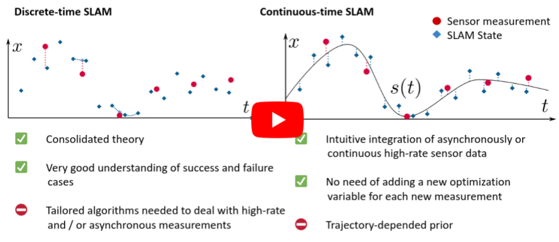

# Continuous- and discrete-time vision-based SLAM

[](https://www.youtube.com/watch?v=_yuZmzJoWUc)
<!--<p style="text-align:center;"> -->

## Publication
If you use this code in an academic context, please cite the following [RA-L 2022 paper](http://rpg.ifi.uzh.ch/docs/RAL2021_Cioffi.pdf).

G. Cioffi, T. Cieslewski, and D. Scaramuzza,
"**Continuous-Time vs. Discrete-Time Vision-based SLAM: A Comparative Study**,"
IEEE Robotics and Automation Letters (RA-L). 2022.

```
@InProceedings{CioffiRal2022
  author = {Cioffi, Giovanni and Ciesleski, Titus and Scaramuzza, Davide},
  title = {Continuous-Time vs. Discrete-Time Vision-based SLAM: A Comparative Study},
  booktitle = {IEEE Robotics and Automation Letters (RA-L)},
  year = {2022}
}
```

## Installation

These instructions have been tested on Ubuntu 18.04 and Ubuntu 20.04 and python 2.7 (python 3 support will come at a later point).

**Prerequisites**

Install [Ceres Solver](http://ceres-solver.org/installation.html) and [COLMAP](https://colmap.github.io/install.html).

**Build the repo**

Git clone the repo:

``` git clone --recursive git@github.com:uzh-rpg/rpg_vision-based_slam.git```

Build:

```cd rpg_vision-based_slam ```

```mkdir build```

```cd build```

```cmake .. -DCMAKE_BUILD_TYPE=Release```

```make -j4```

## Run

We provide here instructions on how to run our SLAM solution using visual, inertial, and global positional measurements. Check below for working examples on the [UZH FPV dataset](https://fpv.ifi.uzh.ch/) and [EuRoC dataset](https://projects.asl.ethz.ch/datasets/doku.php?id=kmavvisualinertialdatasets).

**COLMAP**

As first step, we run COLMAP to get an initial camera trajectory as well as a sparse 3D map.

We provide python scripts that can be used to generate config files for COLMAP (run COLMAP from command line). Check: ```scripts/python/create_colmap_project_$dataset-name$.py```

Extract the camera trajectory from COLMAP output:

```python scripts/python/extract_traj_estimate_from_colmap_$dataset-name$.py $FLAGS$```

**Continuous-time SLAM**

Fit the B-spline to the camera trajectory:

(from the build folder)

```./fit_spline_to_colmap $CONFIG_FILE$```

Initial spatial aligment (scale and pose) of the B-spline to the global frame:

```python scripts/python/initialize_spline_to_global_frame_spatial_alignment.py $FLAGS$```

Align spline to the global frame:

(from the build folder)

```./align_spline_to_global_frame $CONFIG_FILE$```

Run full-batch optimization:

(from the build folder)

```./optimize_continuous_time $CONFIG_FILE$```

**Discrete-time SLAM**

Spatial aligment (scale and pose) of the camera trajectory estimated by COLMAP to the global frame:

```python scripts/python/transform_colmap_to_global_frame.py $FLAGS$```

Run full-batch optimization:

(from the build folder)

```./optimize_discrete_time $CONFIG_FILE$```

## Example: UZH-FPV dataset

We give here an example on how to run the continuous-time SLAM formulation on the sequence **indoor forward facing 3 snapdragon** of the [UZH FPV dataset](https://fpv.ifi.uzh.ch/).

**Data preparation**

Create the folder ***rpg_vision-based_slam/datasets/UZH-FPV/indoor_forward_3_snapdragon***.

Extract the content of the .zip files [raw data](http://rpg.ifi.uzh.ch/datasets/uzh-fpv-newer-versions/v3/indoor_forward_3_snapdragon_with_gt.zip) and [leica measurements](http://rpg.ifi.uzh.ch/datasets/uzh-fpv-newer-versions/raw/indoor_forward_3.zip) in this folder.

The file ***datasets/UZH-FPV/calib/indoor_forward_calib_snapdragon/camchain-imucam-..indoor_forward_calib_snapdragon_imu_simple.yaml*** contains a simplified version (for yaml parsing) of the [calibration files](http://rpg.ifi.uzh.ch/datasets/uzh-fpv/calib/indoor_forward_calib_snapdragon.zip).

**Run COLMAP**

Create the COLMAP project

```python scripts/python/create_colmap_project_uzhfpv_dataset.py --env=i --cam=fw --nr=3 --sens=snap --cam_i=left```

This script creates config files to use in COLMAP. It will also print in the terminal the commands to execute in order to run COLMAP:

```colmap database_creator --database_path $path-to-root-folder$/datasets/UZH-FPV/colmap/indoor_forward_3_snapdragon/database.db```

`colmap feature_extractor --project_path $path-to-root-folder$/datasets/UZH-FPV/colmap/indoor_forward_3_snapdragon/feature_extractor_config.ini`

`colmap sequential_matcher --project_path $path-to-root-folder$/datasets/UZH-FPV/colmap/indoor_forward_3_snapdragon/sequential_matcher_config.ini`

`colmap mapper --project_path $path-to-root-folder$/datasets/UZH-FPV/colmap/indoor_forward_3_snapdragon/mapper_config.ini`

Visualize results using the COLMAP gui:

```colmap gui```

```File -> Import model -> Select folder containing the model, e.g. folder 0```

```colmap gui project_path --database_path $path-to-/database.db$ --image_path $path-to-img-folder$```

Extract COLMAP estimated trajectory:

```python scripts/python/extract_traj_estimate_from_colmap_uzhfpv.py --env=i --cam=fw --nr=3 --sens=snap --cam_i=left```

Prepare Leica measurements:

```python scripts/python/make_leica_minimal.py --env=i --cam=fw --nr=3 --sens=snap```

**Run Continuous-time SLAM**

```mkdir -p results/UZH_FPV```

``` cd build```

```./fit_spline_to_colmap ../experiments/UZH_FPV/indoor_forward_3_snapdragon/colmap_fitted_spline/indoor_forward_3_snapdragon.yaml```

```python ../scripts/python/initialize_spline_to_global_frame_spatial_alignment_uzhfpv.py --config ../experiments/UZH_FPV/indoor_forward_3_snapdragon/spline_global_alignment/indoor_forward_3_snapdragon.yaml --env=i --cam=fw --nr=3 --sens=snap --gui```

```./align_spline_to_global_frame ../experiments/UZH_FPV/indoor_forward_3_snapdragon/spline_global_alignment/indoor_forward_3_snapdragon.yaml```

```./optimize_continuous_time ../experiments/UZH_FPV/indoor_forward_3_snapdragon/full_batch_optimization/continuous_time/indoor_forward_3_snapdragon.yaml```

**Run Discrete-time SLAM**

```cd build```

```python ../scripts/python/transform_colmap_to_global_frame.py --config ~/rpg_vision-based_slam/experiments/UZH_FPV/indoor_forward_3_snapdragon/colmap_global_alignment/indoor_forward_3_snapdragon.yaml --gui```

```./optimize_discrete_time ../experiments/UZH_FPV/indoor_forward_3_snapdragon/full_batch_optimization/discrete_time/indoor_forward_3_snapdragon.yaml```

**Plot results**

Plot results of spline fitting:

```python scripts/python/plot_results_spline_fitting_to_colmap_traj.py --config experiments/UZH_FPV/indoor_forward_3_snapdragon/colmap_fitted_spline/indoor_forward_3_snapdragon.yaml``` 

Plot results of spline aligment:

```python scripts/python/plot_results_spline_global_frame_alignment.py --config experiments/UZH_FPV/indoor_forward_3_snapdragon/spline_global_alignment/indoor_forward_3_snapdragon.yaml```

Plot final results:

```python scripts/python/plot_results_continuous_time.py --config experiments/UZH_FPV/indoor_forward_3_snapdragon/full_batch_optimization/continuous_time/indoor_forward_3_snapdragon.yaml```

```python scripts/python/plot_results_discrete_time.py --config experiments/UZH_FPV/indoor_forward_3_snapdragon/full_batch_optimization/discrete_time/indoor_forward_3_snapdragon.yaml```

## Example: EuRoC dataset

We give here an example on how to run the continuous-time and the discrete-time SLAM formulations on the sequence **V2 01 easy** of the [EuRoC dataset](https://projects.asl.ethz.ch/datasets/doku.php?id=kmavvisualinertialdatasets).

**Data preparation**

Create the folder ***rpg_vision-based_slam/datasets/EuRoC/V2_01_easy***.

Download the [rosbag](http://robotics.ethz.ch/~asl-datasets/ijrr_euroc_mav_dataset/vicon_room2/V2_01_easy/V2_01_easy.bag) in this folder. Use the following script to extract the data:

```python scripts/python/extract_from_euroc_rosbag.py --room=V2 --nr=1 --cam=right```

The file ***datasets/EuRoC/calib/Vicon_room/calib.yaml*** contains the calibration file for this sequence.

**Run COLMAP**

Create the COLMAP project

```python scripts/python/create_colmap_project_euroc_dataset.py --room=V2 --nr=1 --cam=right```

Follow the output of the previous script to run COLMAP.

Extract COLMAP estimated trajectory:

```python scripts/python/extract_traj_estimate_from_colmap_euroc.py --room=V2 --nr=1 --cam=right --colmap_model_id=0```

Create global positional measurements from the ground truth:

```python scripts/python/extract_euroc_groundtruth.py --room=V2 --nr=1```

```python scripts/python/make_global_measurements_euroc.py --room=V2 --nr=1 --freq=10.0 --noise=0.10```

**Run Continuous-time SLAM**

```mkdir -p results/EuRoC```

``` cd build```

```./fit_spline_to_colmap ../experiments/EuRoC/V2_01_easy/colmap_fitted_spline/v2_01_easy.yaml```

```python ../scripts/python/initialize_spline_to_global_frame_spatial_alignment.py --config ~/rpg_vision-based_slam/experiments/EuRoC/V2_01_easy/spline_global_alignment/v2_01_easy.yaml --gui```

```./align_spline_to_global_frame ../experiments/EuRoC/V2_01_easy/spline_global_alignment/v2_01_easy.yaml```

```./optimize_continuous_time ../experiments/EuRoC/V2_01_easy/full_batch_optimization/continuous_time/v2_01_easy.yaml```

**Run Discrete-time SLAM**

```python scripts/python/transform_colmap_to_global_frame.py --config ~/rpg_vision-based_slam/experiments/EuRoC/V2_01_easy/colmap_global_alignment/v2_01_easy.yaml --gui```

```./optimize_discrete_time ../experiments/EuRoC/V2_01_easy/full_batch_optimization/discrete_time/v2_01_easy.yaml```

## Run with a sub-set of sensor modalities

We give here examples on how to run our SLAM algorithm with a sub-set of the sensor modalities.

We use the sequence **V2 01 easy** of the [EuRoC dataset](https://projects.asl.ethz.ch/datasets/doku.php?id=kmavvisualinertialdatasets).

**Global-Visual SLAM**

```cd build```

For continuous time:

```./optimize_gv_continuous_time ../experiments/EuRoC/V2_01_easy/full_batch_optimization_gv/continuous_time/v2_01_easy.yaml```

For discrete time:

```./optimize_gv_discrete_time ../experiments/EuRoC/V2_01_easy/full_batch_optimization_gv/discrete_time/v2_01_easy.yaml```

**Global-Inertial SLAM**

For continuous time:

```cd build```

```./fit_spline_to_gp_measurements ../experiments/EuRoC/V2_01_easy/fit_spline_on_gp_meas/v2_01_easy.yaml```

```./optimize_gi_continuous_time ../experiments/EuRoC/V2_01_easy/full_batch_optimization_gi/continuous_time/v2_01_easy.yaml```

For discrete time:

```./optimize_gi_discrete_time ../experiments/EuRoC/V2_01_easy/full_batch_optimization_gi/discrete_time/v2_01_easy.yaml```

**Visual-Inertial SLAM**

The estimated trajectory by COLMAP needs to be aligned to a gravity aligned frame. [This script](https://github.com/uzh-rpg/rpg_vision-based_slam/blob/main/src/align_spline_to_global_frame.cpp) is a good starting point to estimate gravity direction using accelerometer measurements. 

For continuous time:

```./optimize_vi_continuous_time ../experiments/EuRoC/V2_01_easy/full_batch_optimization_vi/continuous_time/v2_01_easy.yaml```

For discrete time

```./optimize_vi_discrete_time ../experiments/EuRoC/V2_01_easy/full_batch_optimization_vi/discrete_time/v2_01_easy.yaml```

## Others

**Trajectory evaluation**

Install the [trajectory evaluation toolbox](https://github.com/uzh-rpg/rpg_trajectory_evaluation).

Single trajectory:

```rosrun rpg_trajectory_evaluation analyze_trajectory_single.py $path-to-folder$```

Multiple trajectories:

```rosrun rpg_trajectory_evaluation analyze_trajectories.py $path-to-config$ --output_dir=$path$ --results_dir=$path$ --platform $value$ --odometry_error_per_dataset --plot_trajectories --rmse_table --rmse_boxplot```

## Credits

This repo uses some external open-source code:

* [RPG trajectory evaluation toolbox](https://github.com/uzh-rpg/rpg_trajectory_evaluation)
* [RPG SVO Pro](https://github.com/uzh-rpg/rpg_svo_pro_open)
* [TUM Lie Group Cumulative B-splines](https://gitlab.com/tum-vision/lie-spline-experiments)
* [COLMAP](https://github.com/colmap/colmap)
* [Kalibr](https://github.com/ethz-asl/kalibr)
* [UZH-FPV Open](https://github.com/uzh-rpg/uzh_fpv_open)

Refer to each open-source code for the corresponding license.

If you note that we missed the information about the use of any other open-source code, please open an issue.
